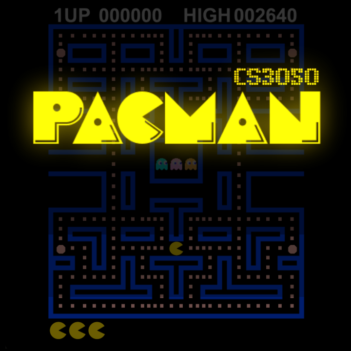

# CS 3050 Final Project - Pacman

**Lillian Ballantine, Shiloh Chiu, Henry Cussatt, Eddie Hyland**

Python Arcade recreation of Pacman for UVM's Software Engineering.



# Installation/Set-Up
In terminal: 
-  `cd` into desired directory and run the following: 
  
    ```
    git clone https://github.com/shilohchiu/pacman.git
    ```

In terminal: 
- Install the requirements: 
  
    ```
    pip install -r requirements.txt
    ```

- Run `main.py` in IDE OR run the following in terminal:

    ```
    cd path/to/directory/pacman
    ```
    
    ```
    python main.py
    ```

# Gameplay
- Click `start` button to start game
- PacMan can be moved using arrow keys.